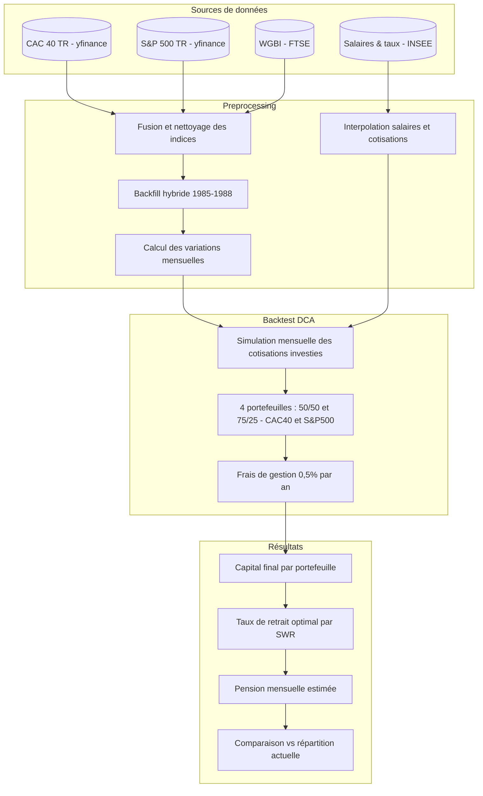
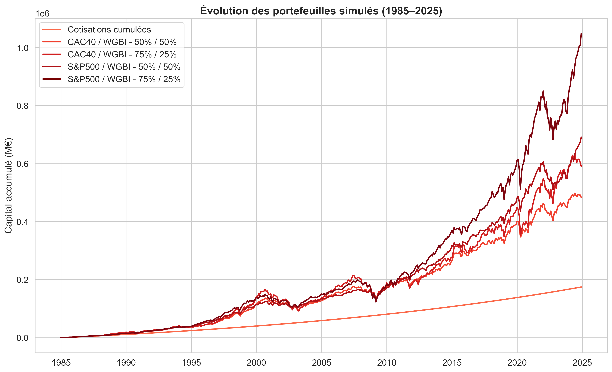
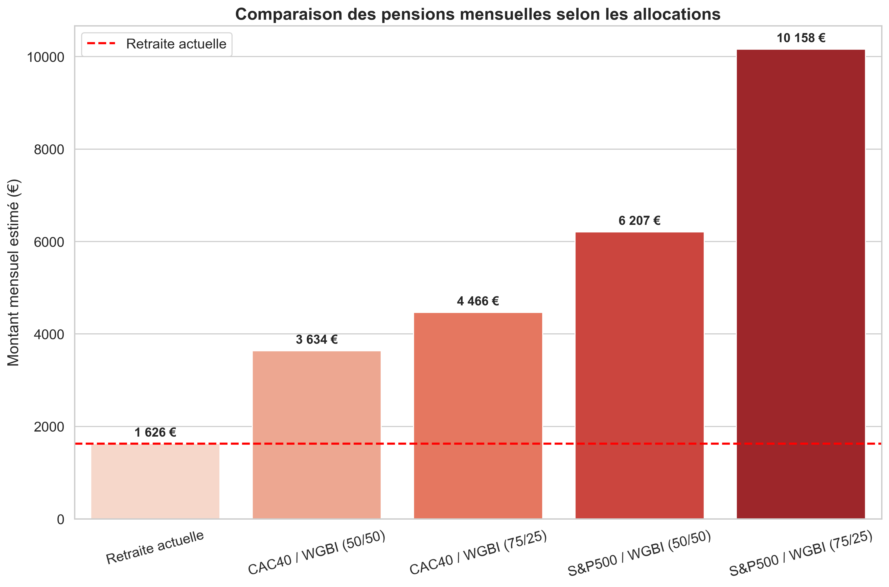

# Backtest Retraite — Capitalisation vs Répartition en France (1985–2025)

[](LICENSE)
[](https://github.com/Vincent-20-100/backtest_retraites/issues)
[](https://github.com/Vincent-20-100/backtest_retraites/stargazers)

---

## Description

**Backtest Retraite** est une étude comparative entre le **système de retraite par répartition** actuel et un **hypothétique modèle par capitalisation**, à l'aide d'une analyse de données et d'un backtesting financier sur la période **1985–2025**.

L'objectif est de démontrer, avec des **données concrètes** et une méthodologie rigoureuse, qu'un système capitalisé aurait généré une retraite plus durable et bénéfique que le système actuel en France.

---

## Rapport final à lire en priorité

Avant d'explorer les notebooks ou de plonger dans le code, commencez par lire le **rapport final** qui résume les résultats, les implications et les grands enseignements de l'étude, sans jargon technique :

👉 [Lire le rapport final](docs/Rapport.md)

Ce document constitue la **vue d'ensemble essentielle** du projet, pensée pour un public large — citoyens curieux, économistes, décideurs ou journalistes — et permet de comprendre les conclusions **avant de décortiquer la méthode** dans les notebooks.

---

## Résultats en un coup d'œil

Sur 40 ans de données réelles (1985–2025), un salarié médian cotisant aux taux historiques aurait accumulé :

| Portefeuille | Capital final | Pension mensuelle | Multiplicateur |
|---|---|---|---|
| CAC 40 / WGBI (50/50) | ~484 000 € | ~3 600 € | **×2,2** |
| CAC 40 / WGBI (75/25) | ~591 000 € | ~4 700 € | **×2,9** |
| S&P 500 / WGBI (50/50) | ~692 000 € | ~6 200 € | **×3,8** |
| S&P 500 / WGBI (75/25) | ~1 049 000 € | ~10 000 € | **×6,2** |

> Référence : pension moyenne brute actuelle ≈ **1 626 €/mois** (DREES 2022). Résultats après déduction d'une contribution de solidarité (≈ 0,56%).

---

## Méthodologie



---

## Hypothèses clés

- **CAC 40 TR** — proxy conservateur d'un fonds souverain français
- **S&P 500 TR** — proxy d'un marché mature soutenu par des décennies de capitalisation (fourchette haute)
- **WGBI** — proxy obligataire (faute de données françaises longues)
- Taux de cotisation historiques : de 15% en 1985 à 24% en 2025 (source INSEE)
- Frais de gestion : 0,5%/an
- Taux de retrait : calculé par formule SWR sur 25 ans (durée de retraite moyenne en France)
- Backfill hybride du CAC 40 TR sur 1985–1988 (données manquantes)

**Effets non modélisés (mais favorables) :** surcapitalisation des entreprises françaises, réduction potentielle des cotisations, hausse des salaires induite.

---

## Structure du repository

```
backtest_retraites/
├── data/
│   ├── raw/               # Données brutes (CAC40, S&P500, FTSE100, WGBI, sources CSV)
│   ├── processed/         # Dataset nettoyé avec backfill (prêt pour le backtest)
│   └── final/             # Résultats finaux (capitaux, pensions simulées)
├── notebooks/
│   ├── Preprocessing.ipynb    # Collecte, fusion, backfill et export du dataset
│   ├── Backtest_V1.ipynb      # Simulation DCA, calcul des capitaux et pensions
│   └── Backtest_V2.ipynb      # Analyses étendues (profils SMIC, médian, D9)
├── charts/                # Graphiques générés (PNG haute résolution)
├── docs/
│   ├── Rapport.md         # Rapport complet de l'étude
│   ├── Résumé.md          # Résumé exécutif (livre blanc)
│   └── sources/           # Sources brutes (INSEE, WGBI, PDF)
├── requirements.txt
└── README.md
```

---

## Notebooks

### `Preprocessing.ipynb`
Constitue le dataset de base utilisé dans le backtest :
- Téléchargement des indices via `yfinance` (CAC 40, S&P 500, FTSE 100)
- Fusion de deux sources partiellement redondantes pour le CAC 40 TR
- **Backfill hybride** des données manquantes 1985–1988 : combinaison d'une méthode par ratio historique et d'une méthode par rendement mensuel moyen
- Export vers `data/processed/DataFrame_backfilled.csv`

### `Backtest_V1.ipynb`
Coeur de la simulation :
- Interpolation des salaires médians et des taux de cotisation (1985–2025)
- Simulation mensuelle en **DCA** sur 4 portefeuilles (CAC40/WGBI & S&P500/WGBI en 50/50 et 75/25)
- Calcul du **taux de retrait optimal** par la formule de Safe Withdrawal Rate (SWR) sur 25 ans
- Intégration du coût de solidarité (ASPA/ASV)
- Comparaison des pensions avec la pension médiane actuelle
- Estimation de la taille d'un fonds souverain hypothétique (8 000–18 000 Mds €)

### `Backtest_V2.ipynb`
Extension du modèle à plusieurs profils de revenus :
- Profil SMIC, médian et D9 (salaire du 9e décile)
- Comparaison inter-profils des capitaux et pensions
- Visualisations avancées par segment

---

## Visualisations





---

## Installation & exécution

### Prérequis
- Python 3.10+
- JupyterLab ou Jupyter Notebook

### Installation

```bash
git clone https://github.com/Vincent-20-100/backtest_retraites.git
cd backtest_retraites

pip install -r requirements.txt
```

### Lancer les notebooks

```bash
jupyter lab
```

Exécuter dans l'ordre :
1. `notebooks/Preprocessing.ipynb`
2. `notebooks/Backtest_V1.ipynb`
3. `notebooks/Backtest_V2.ipynb` *(optionnel)*

> Les données brutes sont déjà incluses dans `data/raw/` — l'étape `yfinance` est commentée dans le preprocessing pour éviter les appels API inutiles.

---

## Stack technique

| Outil | Usage |
|---|---|
| `pandas` / `numpy` | Manipulation et calcul des données |
| `matplotlib` / `seaborn` | Visualisations |
| `yfinance` | Collecte des indices boursiers |
| `scikit-learn` | Modèles testés pour le backfill (régression, Random Forest) |
| JupyterLab | Environnement de développement |

---

## Limites & points de vigilance

- **Sequence of returns risk** — le moment de départ à la retraite influence fortement la pension
- **Transition non modélisée** — passer d'un système à l'autre imposerait une double charge temporaire aux actifs
- **Risque de change** — S&P 500 et WGBI exprimés en dollars, non convertis en euros
- **Portefeuilles statiques** — pas de gestion pilotée ni de rééquilibrage progressif

Ces limites sont documentées en détail dans la section 8 du [Rapport](docs/Rapport.md).

---

📬 Pour toute question ou contribution : ouvrez une *issue* ou contactez l'auteur.
