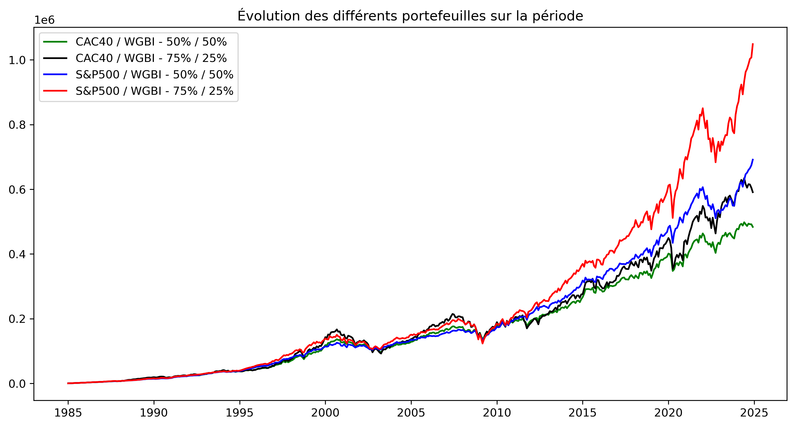

# 📊 Rapport d’étude — Retraite par capitalisation (1985–2025)

## 🧭 Pourquoi ce rapport ?

Alors que la question des retraites revient sans cesse dans le débat public, ce rapport propose autre chose qu’une énième réforme paramétrique.

Il pose une question simple :

> Que se serait-il passé si les cotisations retraite avaient été investies chaque mois, plutôt que redistribuées immédiatement ?

Pour y répondre, une simulation rigoureuse a été menée, sur **40 années de données économiques** (1985 à 2025). Le but : comparer factuellement les résultats d’un système **par capitalisation** avec ceux du modèle **par répartition** utilisé aujourd’hui en France.

---

## 1. 🎭 Le scénario simulé

### Cotisation :
- Basée sur le **salaire médian** français (source INSEE).
- Montant prélevé chaque mois selon les **taux de cotisation historiques.**.

### Durée :
- **40 ans d’épargne continue**, de janvier 1985 à décembre 2024.

### Portefeuilles testés :
- 🟦 **Profil prudent** : 50% actions / 50% obligations
- 🟩 **Profil dynamique** : 75% actions / 25% obligations

### Retraite simulée :
- Conversion du capital en pension via un **taux de retrait annuel** de **9%** du capital, calculé pour assurer un fonds soutenable sur une durée moyenne de retraite de **25 ans** (moyenne actuelle).

### Redistribution :
- Hypothèse d’un **prélèvement de solidarité** pour financer une pension minimale universelle (basé sur les chiffre actuels de l'ASPA  et l'ASV).

---

2. 🎯 Partis pris & Hypothèses

Ce projet repose sur une série de choix méthodologiques prudents afin d’éviter toute surestimation des performances d’un modèle capitalisé. Il s’agit de montrer que même dans un scénario conservateur, la capitalisation aurait surperformé la répartition.

Hypothèses retenues :

✅ Utilisation du CAC 40 TR comme proxy d’un fonds souverain français (scénario conservateur).

✅ Utilisation du S&P 500 TR comme scénario optimiste, non pas pour fantasmer un rendement américain, mais pour représenter un portefeuille mondialisé performant tel que celui qu’un fonds souverain aurait pu viser.

✅ Taux de cotisation fixe sur 40 ans, sans optimisation ni arbitrage.

✅ Hypothèse de retrait prudente : 9 %, calibrée sur une durée moyenne de retraite (25 ans).

✅ Aucune prise en compte des frais de gestion ni de l’inflation (neutralisation simplificatrice).

✅ Backfill du CAC 40 TR entre 1985 et 1990 par régression multivariée (S&P500 + FTSE100).

✅ Utilisation du WGBI comme proxy obligataire (faute de données françaises longues).

Effets bénéfiques non modélisés (mais potentiellement favorables) :

📈 Surcapitalisation des entreprises françaises via l’épargne retraite (effet macro positif absent du modèle).

📉 Réduction potentielle des cotisations grâce à la performance, stimulant la consommation, l’épargne libre, ou l’emploi.

---

## 3. 📈 Résultats clés

### 📊 Performance des marchés (1985–2025)

| Indice simulé        | Multiplicateur de capital | Rendement annualisé |
|----------------------|---------------------------|----------------------|
| **S&P 500 TR**       | ×76                       | 11,47 %              |
| **CAC 40 TR**        | ×32                       | 9,06 %               |
| **WGBI (oblig.)**    | ×5                        | 4,44 %               |

### 💰 Capital et pensions estimées

| Type de portefeuille | Capital final            | Pension estimée       | Multiplicateur (vs retraite actuelle) |
|----------------------|--------------------------|-----------------------|---------------------------------------|
| Prudent (50/50)      | ~580                     | ~3600 - 6200€         | **~x3**                               |
| Dynamique (75/25)    | ~820                     | ~4700 - 10000€        | **~x5**                               |

Ces résultats tiennent compte de l’augmentation des salaire et des taux de prélèvements historiques et sont simulés avec une grande prudence : pas de levier, pas d’investissement exotique, pas de stock-picking.

### 👑 Taille du fond souverain estimée
Le système français actuel repose sur une logique de redistribution immédiate : les cotisations des actifs servent directement à payer les pensions des retraités.  \
Ce modèle ne constitue aucune réserve, et ne laisse aucune marge de manœuvre en cas de choc démographique ou économique.

À l’inverse, un système par capitalisation permettrait aux cotisations de s’accumuler dans un fonds souverain, générant des rendements sur le long terme et assurant une vraie stabilité. \
📊 En projetant notre simulation sur l’ensemble des retraités actuels, **le capital total** qui aurait été constitué varie entre :
- **8 228 milliards** d’euros (profil prudent),
- **17 833 milliards** d’euros (profil dynamique).

Ce sont des ordres de grandeur comparables à plusieurs années de PIB français.
Un tel stock de capital permettrait d’assurer une soutenabilité structurelle, une autonomie stratégique, et une capacité de redistribution renforcée, sans dépendre du bon vouloir des générations futures.

---

## 4. 📊 Visualisations clés

### Performance des différents portefeuilles

### Comparaison des pensions versées selon les modèles

---

## 5. 🧠 Interprétation des résultats

### ✔️ Ce que démontre la simulation
- La capitalisation **crée un stock de richesse** au fil du temps, grâce aux intérêts composés et à la croissance des actifs.
- Ce stock constitue un **véritable fonds retraite** : mobilisable en cas de crise, transmissible, et générateur de revenus stables.
- Même en portefeuille prudent, **les rendements dépassent de très loin** ceux du système par répartition.
- Une **redistribution ciblée** reste possible sans compromettre la viabilité du système, en prélevant une fraction minime des performances.

### ❌ Ce que le système actuel ne permet plus
- Il **ne constitue aucun fond** : chaque euro collecté est immédiatement redistribué. Aucune réserve, aucune capitalisation.
- Il est donc **sans aucune marge de manœuvre** : en cas de ralentissement économique, de baisse des naissances ou de choc démographique, il n’a **aucun amortisseur**.
- Il **ne laisse rien au cotisant** : pas d’héritage, pas de souplesse, pas de visibilité.
- Il repose sur une **logique de flux** ultra-sensible aux aléas économiques et politiques, rendant chaque réforme potentiellement explosive.

### ⚠️ Le fond du problème : stock vs flux
Un système **capitalisé** repose sur un **stock d’actifs**, qui produit des revenus.  
Un système **par répartition** repose sur un **flux de cotisations**, qui doit être constant et croissant pour ne pas s’effondrer.

> ✅ La capitalisation fonctionne même en cas de stagnation.  
> ❌ La répartition s'effondre dès que la croissance ou la natalité faiblit.

### 🏗️ Un effet secondaire vertueux : financer l’économie réelle

Au-delà de la performance individuelle, un système de retraite capitalisé **transforme chaque cotisation en levier économique**.

Pourquoi ? Parce qu’un fonds souverain bien géré investit dans **des entreprises, des infrastructures, des obligations publiques ou privées**, et donc **alimente directement l’économie réelle**.

Dans notre simulation, nous avons volontairement choisi des indices représentatifs :  
- Le **CAC 40 TR**, proxy d’un portefeuille français diversifié,  
- Le **S&P 500 TR**, comme projection d’un marché international mature,  
- Le **WGBI TR**, représentant les obligations souveraines mondiales.

Ces choix ne sont pas anodins : ils montrent qu’un tel fonds aurait **boosté l’investissement productif**, **soutenu les entreprises** et **offert des capitaux stables** à long terme.

Contrairement aux politiques de relance monétaire (QE, dettes publiques, taux bas artificiels), ce modèle **n’injecte pas d’argent magique** : il transforme **l’épargne réelle** en **investissement pérenne**.

> 📌 Un système de retraite capitalisé n’est pas qu’un filet social.  
> C’est un **vecteur puissant de développement économique**, piloté par la réalité et non par la dette.

---

## 6. 📣 À qui s’adresse ce rapport ?

Ce rapport s’adresse avant tout :

- À celles et ceux qui **préfèrent les faits aux slogans**, les chiffres aux idées reçues.
- Aux curieux qui veulent **comprendre comment fonctionne vraiment notre système de retraite**, au-delà des débats partisans.
- Aux citoyens soucieux d’évaluer **les alternatives possibles**, de manière rigoureuse et documentée.
- Aux professionnels de la finance, de la donnée, de l’économie ou de la gestion publique qui souhaitent **tester un scénario systémique, chiffré et transparent**.
- Aux responsables politiques en quête de **solutions pérennes**, fondées sur la réalité, et non sur des hypothèses déconnectées du terrain.

> Ce rapport ne cherche pas à convaincre par l’idéologie,  
> mais à **éclairer par les faits**.

---

## 7. 🔍 Pour aller plus loin

### 📂 Le code, les données, les visualisations et les hypothèses sont 100% open-source :

👉 GitHub : [github.com/Vincent-20-100/backtest_retraites](https://github.com/Vincent-20-100/backtest_retraites)

---

> « Ce qui est investi, fructifie. Ce qui est redistribué, disparaît. »

Face aux impasses comptables du système actuel, la capitalisation offre une **alternative concrète, mesurable, et juste**.

Il est temps de remettre les faits au cœur du débat.

---
