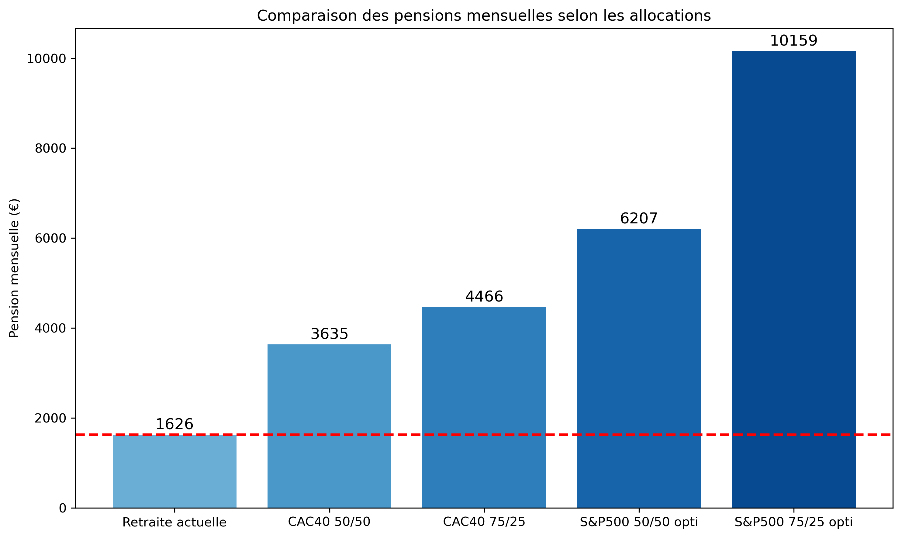

# 📊 Rapport d’étude — Retraite par capitalisation (1985–2025)

## 🧭 Pourquoi ce rapport ?

La question des retraites agite régulièrement le débat public en France. Les réformes se succèdent, souvent techniques, toujours conflictuelles. Pourtant, un angle reste systématiquement évité : celui d’un **changement de modèle structurel**.

Ce rapport ne propose pas une énième réforme des paramètres existants.  
Il explore **une alternative complète** :  
> *Et si, depuis 1985, les cotisations retraite avaient été capitalisées plutôt que redistribuées ?*

Autrement dit : que se serait-il passé si chaque salarié avait vu ses cotisations placées, mois après mois, dans un fonds commun investi dans l’économie réelle — plutôt que de financer directement les pensions actuelles ?

Pour répondre à cette question, une **simulation rigoureuse** a été conduite à partir de **40 années de données économiques réelles** (1985–2025), en comparant deux approches :  
- Le système **par répartition** actuellement en vigueur,  
- Et un système **par capitalisation**, tel qu’il aurait pu être mis en place dès 1985 sous la forme d'un fond souverain.

Ce rapport vise à fournir **des ordres de grandeur concrets**, lisibles et vérifiables, pour éclairer un débat trop souvent idéologique.

> Car comprendre ce qui aurait pu être, c’est déjà mieux choisir ce qui peut encore advenir.

---

## 1. 🎭 Le scénario simulé

### Cotisation :
- Basée sur le **salaire médian** français (source INSEE).
- Montant prélevé chaque mois selon les **taux de cotisation historiques.**

### Durée :
- **40 ans d’épargne continue**, de janvier 1985 à décembre 2024.

### Portefeuilles testés :
- **Profil prudent** : 50% actions / 50% obligations
- **Profil dynamique** : 75% actions / 25% obligations

### Retraite simulée :
- Conversion du capital en pension via un **taux de retrait annuel** de **9%** du capital, calculé pour assurer un fonds soutenable sur une durée moyenne de retraite de **25 ans** (moyenne actuelle).

### Redistribution :
- Hypothèse d’un **prélèvement de solidarité** pour financer une pension minimale universelle (basé sur les chiffre actuels de l'ASPA  et l'ASV).

---

## 2. 🎯 Partis pris & Hypothèses

Ce projet repose sur une série de choix méthodologiques prudents afin d’éviter toute surestimation des performances d’un modèle capitalisé. Il s’agit de montrer que même dans un scénario conservateur, la capitalisation aurait surperformé la répartition.

Hypothèses retenues :
- Utilisation du CAC 40 TR comme proxy d’un fonds souverain français (scénario conservateur).
- Utilisation du S&P 500 TR comme proxy de performance haute — non pas pour idéaliser les rendements américains, mais pour représenter une trajectoire réaliste qu’aurait pu suivre un CAC 40 soutenu par des décennies de capitalisation massive. Ce choix permet d’estimer une fourchette haute crédible, dans l’hypothèse où un fonds souverain français aurait contribué à surcapitaliser durablement les entreprises nationales.
- Taux de cotisation historiques (source INSEE).
- Hypothèse de retrait prudente : 9 %, calibrée sur une durée moyenne de retraite (25 ans).
- Prise en compte de 0,5% de frais de gestion.
- Backfill du CAC 40 TR entre 1985 et 1990 (données manquantes).
- Utilisation du WGBI comme proxy obligataire (faute de données françaises longues).

Effets bénéfiques non modélisés (mais potentiellement favorables) :
- Surcapitalisation des entreprises françaises via l’épargne retraite (effet macro positif absent du modèle, comme la hausse du salaire médian).
- Réduction potentielle des cotisations grâce à la performance, stimulant la consommation, l’épargne libre, ou l’emploi.

---

## 3. 📈 Résultats clés

### 📊 Performance des marchés (1985–2025)

| Indice simulé        | Multiplicateur de capital | Rendement annualisé |
|----------------------|---------------------------|----------------------|
| **S&P 500 TR**       | ×76                       | 11,47 %              |
| **CAC 40 TR**        | ×32                       | 9,06 %               |
| **WGBI (oblig.)**    | ×5                        | 4,44 %               |

### 💰 Capital et pensions estimées

| Type de portefeuille  | Capital final            | Pension estimée       | Multiplicateur (vs retraite actuelle) |
|-----------------------|--------------------------|-----------------------|---------------------------------------|
| CAC 40 / WGBI (50/50) | 484 000 €                | ~3600                 | **~x2.2**                             |
| CAC 40 / WGBI (75/25) | 591 000 €                | ~4700                 | **~x2.9**                             |
| S&P 500 / WGBI (50/50)| 692 000 €                | ~6200€                | **~x3.9**                             |
| S&P 500 / WGBI (75/25)| 1 049 000 €              | ~10000€               | **~x6.2**                             |

Ces résultats tiennent compte de l’augmentation des salaire et des taux de prélèvements historiques et sont simulés avec une grande prudence : pas de levier, pas d’investissement exotique, pas de stock-picking.

### 👑 Taille du fond souverain estimée
Le système français actuel repose sur une logique de redistribution immédiate : les cotisations des actifs servent directement à payer les pensions des retraités.  \
Ce modèle ne constitue aucune réserve, et ne laisse aucune marge de manœuvre en cas de choc démographique ou économique.

À l’inverse, un système par capitalisation permettrait aux cotisations de s’accumuler dans un fonds souverain, générant des rendements sur le long terme et assurant une vraie stabilité. \
📊 En projetant notre simulation sur l’ensemble des retraités actuels, **le capital total** qui aurait été constitué varie entre :
- **8 228 milliards** d’euros (profil prudent),
- **17 833 milliards** d’euros (profil dynamique).

Ce sont des ordres de grandeur comparables à plusieurs années de PIB français.
Un tel stock de capital permettrait d’assurer une soutenabilité structurelle, une autonomie stratégique, et une capacité de redistribution renforcée, sans dépendre du bon vouloir des générations futures.

---

## 4. 📊 Visualisations clés

### Performance des différents portefeuilles

### Comparaison des pensions versées selon les modèles

---

## 5. 🧠 Interprétation des résultats

### ✔️ Ce que démontre la simulation
- La capitalisation **crée un stock de richesse** au fil du temps, grâce aux intérêts composés et à la croissance des actifs.
- Ce stock constitue un **véritable fonds retraite** : mobilisable en cas de crise, transmissible, et générateur de revenus stables.
- Même en portefeuille prudent, **les rendements dépassent de très loin** ceux du système par répartition.
- Une **redistribution ciblée** reste possible sans compromettre la viabilité du système, en prélevant une fraction minime des performances.

### ❌ Ce que le système actuel ne permet plus
- Il **ne constitue aucun fond** : chaque euro collecté est immédiatement redistribué. Aucune réserve, aucune capitalisation.
- Il est donc **sans aucune marge de manœuvre** : en cas de ralentissement économique, de baisse des naissances ou de choc démographique, il n’a **aucun amortisseur**.
- Il **ne laisse rien au cotisant** : pas d’héritage, pas de souplesse, pas de visibilité.
- Il repose sur une **logique de flux** ultra-sensible aux aléas économiques et politiques, rendant chaque réforme potentiellement explosive.

### ⚠️ Le fond du problème : stock vs flux
Un système **capitalisé** repose sur un **stock d’actifs**, qui produit des revenus.  
Un système **par répartition** repose sur un **flux de cotisations**, qui doit être constant et croissant pour ne pas s’effondrer.

> ✅ La capitalisation fonctionne même en cas de stagnation.  
> ❌ La répartition s'effondre dès que la croissance ou la natalité faiblit.

### 🏗️ Un effet secondaire vertueux : financer l’économie réelle

Au-delà de la performance individuelle, un système de retraite capitalisé **transforme chaque cotisation en levier économique**.

Pourquoi ? Parce qu’un fonds souverain bien géré investit dans **des entreprises, des infrastructures, des obligations publiques ou privées**, et donc **alimente directement l’économie réelle**.

Dans notre simulation, nous avons volontairement choisi des indices représentatifs :  
- Le **CAC 40 TR**, proxy d’un portefeuille français diversifié,  
- Le **S&P 500 TR**, comme projection d’un marché international mature,  
- Le **WGBI TR**, représentant les obligations souveraines mondiales.

Ces choix ne sont pas anodins : ils montrent qu’un tel fonds aurait **boosté l’investissement productif**, **soutenu les entreprises** et **offert des capitaux stables** à long terme.

Contrairement aux politiques de relance monétaire (QE, dettes publiques, taux bas artificiels), ce modèle **n’injecte pas d’argent magique** : il transforme **l’épargne réelle** en **investissement pérenne**.

> 📌 Un système de retraite capitalisé n’est pas qu’un filet social.  
> C’est un **vecteur puissant de développement économique**, piloté par la réalité et non par la dette.

---

## 6. 📣 À qui s’adresse ce rapport ?

Ce rapport s’adresse avant tout :

- À celles et ceux qui **préfèrent les faits aux slogans**, les chiffres aux idées reçues.
- Aux curieux qui veulent **comprendre comment fonctionne vraiment notre système de retraite**, au-delà des débats partisans.
- Aux citoyens soucieux d’évaluer **les alternatives possibles**, de manière rigoureuse et documentée.
- Aux professionnels de la finance, de la donnée, de l’économie ou de la gestion publique qui souhaitent **tester un scénario systémique, chiffré et transparent**.
- Aux responsables politiques en quête de **solutions pérennes**, fondées sur la réalité, et non sur des hypothèses déconnectées du terrain.

> Ce rapport ne cherche pas à convaincre par l’idéologie,  
> mais à **éclairer par les faits**.

---

## 7. 🔍 Pour aller plus loin

### 📂 Le code, les données, les visualisations et les hypothèses sont 100% open-source :

👉 GitHub : [github.com/Vincent-20-100/backtest_retraites](https://github.com/Vincent-20-100/backtest_retraites)

> « Ce qui est investi, fructifie. Ce qui est redistribué, disparaît. »

Face aux impasses comptables du système actuel, la capitalisation offre une **alternative concrète, mesurable, et juste**.

Il est temps de remettre les faits au cœur du débat.

---

## 📉 8. Limites majeures et angles morts du modèle

Ce rapport pose les bases d’une alternative structurelle, mais certains aspects importants n’ont volontairement pas été modélisés. Ils constituent des **points de vigilance essentiels** pour tout débat sérieux autour d’un modèle capitalisé.

### Le risque de « sequence of returns »

Dans un système capitalisé, **le moment où l’on prend sa retraite compte autant que le capital accumulé**.  
Deux retraités ayant exactement le même portefeuille peuvent toucher des pensions très différentes selon la conjoncture au moment de leur départ.

> Si les trois premières années de retraite coïncident avec une crise (comme en 2001, 2008 ou 2022), le capital fond rapidement et un taux de retrait de 9 % devient insoutenable.

Ce phénomène, bien connu sous le nom de *sequence of returns risk*, est l’une des principales limites de la capitalisation individuelle. Il explique en partie l’**aversion au risque élevée des opinions publiques** sur ce sujet.

Nous ne l’avons pas modélisé ici, mais il devrait impérativement l’être dans une version avancée du modèle (voir section suivante).

### La difficulté de transition entre systèmes

Le débat ne porte pas seulement sur « quel système est le meilleur », mais sur **comment passer de l’un à l’autre sans sacrifier une génération**.

Aujourd’hui, les cotisations des actifs financent directement les pensions.  
Demander aux mêmes actifs de capitaliser en parallèle reviendrait à leur imposer **une double charge**, politiquement et socialement intenable.

> C’est le vrai talon d’Achille de tout projet de bascule vers la capitalisation à grande échelle : **qui finance la transition, et comment ?**

Bien que ce rapport se concentre sur les performances d’un système capitalisé à maturité, **tout scénario réaliste devra intégrer une phase de cohabitation, de montée en charge progressive, et d'arbitrages sociaux complexes**.

---

## 9. 🔧 Pistes d’amélioration du modèle

Cette étude constitue une première base rigoureuse, mais simplifiée. Elle vise avant tout à fournir des ordres de grandeur.  
Plusieurs extensions ou affinement du modèle pourraient être envisagés pour mieux intégrer les limites évoquées précédemment et améliorer la robustesse de l’analyse.

### Intégration de scénarios de marché aléatoires (volatilité individuelle)

Pour mieux représenter le risque réel vécu par un retraité individuel — notamment le **risque de sequence of returns** — il serait pertinent d'ajouter :

- Des simulations aléatoires de marchés via **méthodes Monte Carlo** ;
- Des scénarios historiques de crise (ex. départ à la retraite en 2001, 2008 ou 2022) ;
- Une analyse de sensibilité du taux de retrait (ex. 5%, 7%, 9%) selon la conjoncture.

Cela permettrait d’identifier les années de départ « à haut risque » et de mieux quantifier la soutenabilité réelle du modèle.

---

### Modélisation d’un mécanisme de transition

Le plus grand défi d’un passage vers la capitalisation est la **double charge temporaire** pour les actifs. Il est essentiel d’intégrer des scénarios de transition réalistes :

- Phase de cohabitation entre répartition et capitalisation (30 à 40 ans) ;
- Simulation de financements transitoires (TVA dédiée, dette, prélèvement exceptionnel, etc.) ;
- Étude de l’impact générationnel pour éviter toute « génération sacrifiée ».

---

### Diversification des profils simulés

Le modèle actuel se base sur un salarié médian. Pour une vision plus représentative :

- Ajouter un profil au SMIC et un profil cadre (quartile supérieur) ;
- Simuler un travailleur indépendant ou un fonctionnaire (cotisations et carrières différentes) ;
- Étudier l’impact redistributif d’un filet de sécurité universel (pension minimale garantie).

---

### Optimisation des allocations d’actifs

Les portefeuilles simulés sont statiques (50/50 et 75/25). Pour plus de réalisme :

- Implémenter une gestion pilotée (plus agressive en début de carrière, plus prudente à l’approche de la retraite) ;
- Rééquilibrage annuel automatique ;
- Introduction d’actifs alternatifs (immobilier, private equity, etc.).

---

### Intégration du risque de change

Le S&P 500 et le WGBI sont exprimés en dollars, alors que les cotisations sont en euros. Deux options :

- Convertir les rendements en euros via le taux EUR/USD historique ;
- Remplacer ces indices par des proxies européens (ex. Euro Stoxx 50, indices obligataires en EUR).

---

### Estimation des effets macroéconomiques positifs

Le modèle est volontairement conservateur et **n’intègre pas les effets systémiques positifs** que pourrait générer un modèle capitalisé à grande échelle. Ces effets mériteraient d’être estimés :

- Hausse de l’investissement privé et de la capitalisation boursière nationale ;
- Réduction possible des prélèvements obligatoires ;
- Hausse de l’épargne individuelle libre (hors retraite) ;
- Baisse de la dette publique via désengagement partiel de l’État.

---

Ces évolutions pourraient faire l’objet d’un second volet, ou d’un projet collaboratif open-source visant à enrichir ce modèle de retraite capitalisée.

---

## 🙏 Remerciements

Je tiens à remercier sincèrement celles et ceux qui ont pris le temps de formuler des retours critiques constructifs, permettant d’identifier avec lucidité les limites de ce travail.

En particulier, merci à **Xavier Delmas** pour sa rigueur intellectuelle et la pertinence de ses remarques.

Leur contribution a permis d’enrichir ce rapport et de clarifier les points clés qui méritent d’être approfondis dans la suite du projet.

